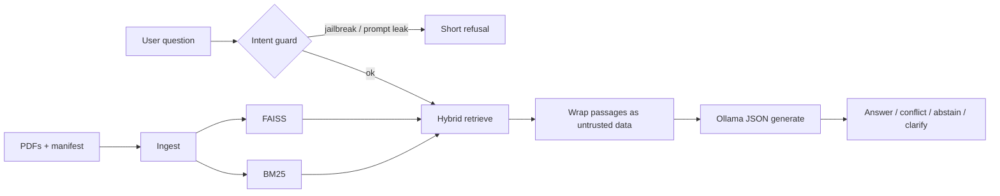

# Cerulean Systems grounded RAG assistant

SAITC Applied AI Engineer take-home: a retrieval-augmented assistant over the official **Cerulean Systems Ltd.** corpus (13 PDFs + `corpus_manifest.json`).

Answers are grounded in retrieved passages, cited, and refused when the corpus does not support them. Document text is treated as untrusted data.

## Run on a fresh machine

### Prerequisites

- Python 3.11+
- [Ollama](https://ollama.com/) for local open-weight generation (this is the required generation path; no commercial chat API)

On Windows, install Ollama from the official installer, then in a terminal:

```bash
ollama pull llama3.1:8b
```

Any other Ollama chat model works if you set `OLLAMA_MODEL`. `llama3.1:8b` is the default this repo was written against.

### Install

```bash
cd saitc
python -m venv venv
venv\Scripts\activate
pip install -r requirements.txt
copy .env.example .env
```

On macOS/Linux use `source venv/bin/activate` and `cp .env.example .env`.

### Configuration

| Variable | Default | Meaning |
|---|---|---|
| `AS_OF_DATE` | `2026-08-27` | “Current” as defined by the assignment. **Hard-coded via config**, not the host clock. |
| `OLLAMA_MODEL` | `llama3.1:8b` | Local generation model |
| `OLLAMA_BASE_URL` | `http://127.0.0.1:11434` | Ollama endpoint |
| `CORPUS_DIR` | `corpus/` | Official PDF pack |
| `EMBEDDING_MODEL` | `sentence-transformers/all-MiniLM-L6-v2` | Local embeddings |

The first embedding load downloads the MiniLM weights from Hugging Face (offline after that).

### Ingest the corpus

```bash
python -m rag.ingest
```

This reads PDFs under `corpus/` (skips the assignment overview PDF), attaches manifest metadata (id, version, effective date, supersedes), chunks by section, and writes FAISS + a BM25 passage file under `data/vectorstore/`.

### Ask a question

Start the API:

```bash
python main.py
```

Then:

```bash
curl -s http://127.0.0.1:8000/health
curl -s http://127.0.0.1:8000/ask -H "Content-Type: application/json" -d "{\"question\": \"What is the company's annual leave policy?\"}"
```

Interactive docs: http://127.0.0.1:8000/docs

Re-ingest (for example after replacing PDFs): `POST /ingest`.

### Official evaluation set

With Ollama running:

```bash
python eval/run_eval.py
```

Writes `eval/results.json` and `eval/results.md`. How I would measure quality beyond these twelve questions is in `eval/EVALUATION.md`.

## Hardware and timing

Recorded on the development laptop used for this submission (fill in after your first run if different):

- OS: Windows 10
- Generation: Ollama `llama3.1:8b` on CPU or GPU depending on the host
- Embeddings: MiniLM-L6-v2 on CPU
- Ingestion of the 13 PDFs: typically well under a minute after the embedding model is cached (corpus is &lt; 100 KB)
- Single query: dominated by the local LLM (often ~5–30 s on CPU; faster with a GPU)

## Architecture



1. **Ingest** loads each company PDF with `pypdf`, joins metadata from `corpus_manifest.json` (PDF header is a fallback), splits on numbered sections so tables tend to stay together, and stores chunks in FAISS plus a JSON passage list for BM25.
2. **Retrieve** runs semantic search and BM25, then **reciprocal rank fusion**. Each chunk is prefixed with document id, title, version, and effective date so retrieval can see metadata.
3. **Guard** refuses a small set of out-of-scope / prompt-extraction queries *before* retrieval so Q9 does not leak approval internals.
4. **Generate** sends retrieved text inside `<untrusted_document>` tags and asks the local model for a JSON object: status, answer, citations, conflicts, confidence. “Current” is **27 August 2026** from `AS_OF_DATE`.

## Technologies and why

| Choice | Why |
|---|---|
| **Ollama + Llama 3.1 8B** | Assignment requires an open-weight generator. Local, no paid API. |
| **MiniLM-L6-v2** | Small, local, good enough for a &lt;100 KB policy corpus. |
| **FAISS + BM25 + RRF** | Semantic search misses exact policy numbers; keyword search misses paraphrases. Hybrid is cheap on this corpus. |
| **Manifest metadata on every chunk** | Price and refund questions are unanswerable without effective dates and supersession. |
| **FastAPI** | One process to ingest, health-check, and ask; easy for reviewers. |
| **Structured JSON replies** | Forces an explicit status (answer / conflict / insufficient / clarification / refused) instead of a fluent paragraph that hides uncertainty. |

**Assumptions**

- The 13 listed PDFs plus the manifest are the complete world. The corpus overview PDF is *not* indexed.
- An employee in Q3 is on the standard 24-day entitlement (new joiner, under five years). Partial months use the 15-calendar-day rule in HR-PRO-011, which the policy says is operative for accrual mechanics.
- For “current” commercial facts, a later effective date that is still ≤ 2026-08-27 wins; legal terms that say they prevail over FAQs also win, and that reasoning is stated rather than implicit.
- User jailbreaks are handled in code; corpus injections are handled by wrapping + the system prompt (defence in depth).

## Known limitations

- The 8B model can still flatten a conflict into a single number if the prompt is ignored; JSON schema is validated but content is not entailed against spans.
- MiniLM is not a legal-domain embedding model; hybrid search is a patch, not a guarantee.
- No cross-encoder reranker.
- FAISS is a local folder, not a concurrent service.
- Guard patterns are narrow by design (avoid blocking legitimate policy questions).

## Five weaknesses that would worry me before real users

1. **Unverified arithmetic** — leave pro-rata is computed by the LLM, not a deterministic function. A wrong month count is a plausible failure.
2. **Injection in retrieved text** — wrapping helps; a stronger model, or stripping known jailbreak sentences from *generation context while keeping them in the audit log*, would be safer.
3. **Ambiguity recall** — if retrieval only returns one kind of “limit”, the model may answer that one instead of asking.
4. **Index freshness** — replacing a PDF requires a full rebuild; there is no document-level delete.
5. **Citation faithfulness** — the model can cite HR-POL-002 while using a number from another chunk. I do not currently check that each cited id actually appeared in the retrieved set *and* supports the claim.

## Deliberately not built

- **UI / chat history** — the assignment is about grounding, not product chrome.
- **Cross-encoder reranking and hybrid-at-scale infra** — optional extras; RRF on 13 docs already saturates recall for this pack.
- **Auth, tenancy, PII redaction** — out of scope for a take-home corpus.
- **Commercial LLM APIs (including Groq)** — disallowed for generation by the brief.
- **Fine-tuning / Graph RAG** — unjustified on this size and would hide the actual failure modes.

## If this were deployed tomorrow

The first worry would be **silent policy error with a citation attached**: a confident, well-cited wrong refund window or approval threshold is worse than an abstention. I would not ship without span-level entailment checks and a human review queue for conflict and calculation answers.

## Substantial external components

LangChain (FAISS + Ollama adapters), Sentence-Transformers, rank-bm25, FastAPI, the official SAITC corpus pack. Generation quality is that of the local Llama 3.1 8B checkpoint you pull with Ollama.
